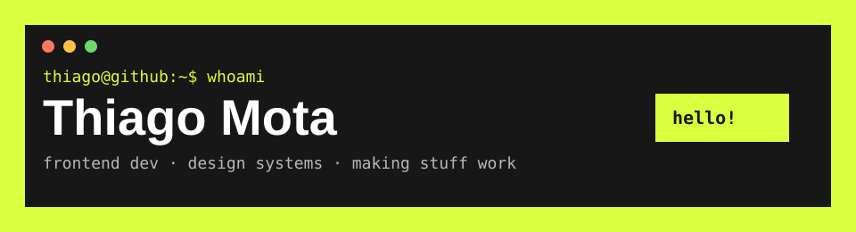

<!-- markdownlint-disable MD013 MD033 MD041 -->

    

    
    

Hey! I'm Thiago. I've been building stuff for the web since 2018, mostly with React and TypeScript. These days, I'm usually working on internal tools and design systems for healthcare products.

Away from the keyboard, you'll find me playing MOBA/FPS games, watching series or anime, and still waiting for One Piece to end while trying to forget the Game of Thrones finale.

## Stuff I Use

### Frontend Stuff

    
    
    
    
    
    
    

### Making Sure It Works

    
    
    

### Other Things I Work With

    
    
    
    
    
    

### The Usual Suspects

    
    
    

## GitHub Things

<picture>
    <source media="(prefers-color-scheme: dark)" srcset="https://raw.githubusercontent.com/TSmota/TSmota/output/github-snake-dark.svg">
    <source media="(prefers-color-scheme: light)" srcset="https://raw.githubusercontent.com/TSmota/TSmota/output/github-snake.svg">
    
</picture>
